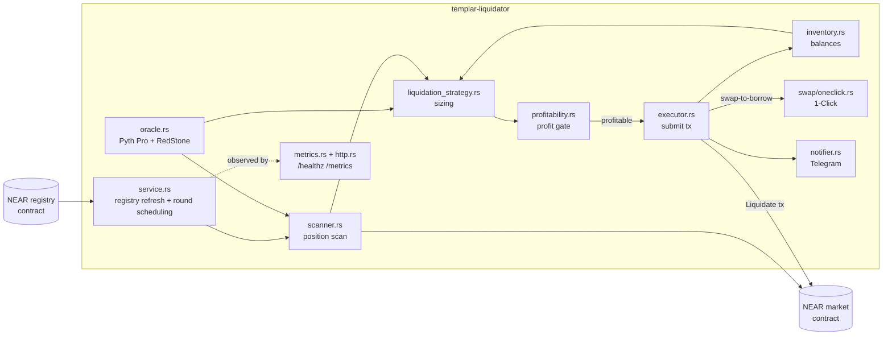

# templar-liquidator

[](https://github.com/Templar-Protocol/templar-liquidator/actions/workflows/ci.yml)
[](LICENSE)
[](https://github.com/Templar-Protocol/templar-liquidator/pkgs/container/templar-liquidator)

An inventory-based liquidation bot for [Templar Protocol](https://templarfi.org) lending markets on [NEAR](https://near.org). It holds a pool of borrow-asset tokens (e.g. USDC), repays the debt of underwater positions directly from that inventory, and receives their collateral at a discount in return. Received collateral can optionally be swapped back into borrow assets so the same inventory is available for the next round.

## Quickstart

Pull the released image and run it with your own `.env` — no registry login
needed, and pin a release tag rather than `:latest` for anything you leave
running:

```bash
cp .env.example .env
nano .env  # fill in the three required vars below
docker run --env-file .env ghcr.io/templar-protocol/templar-liquidator:1.0.0
```

Or build and run locally with Docker Compose:

```bash
cp .env.example .env
nano .env
docker compose up
```

`docker compose up` **builds from source** — it compiles the crate and its
git dependencies inside the image, including an `npm install` a dependency's
`build.rs` runs — so the first run is slow (several minutes). Reach for it
when you want to audit or modify what you run; the published image is the
faster way to just try the bot.

Three env vars are required — the bot refuses to start without them:

| Var | What it is |
|---|---|
| `REGISTRY_ACCOUNT_IDS` | Templar market registry contract(s) to discover markets from, e.g. `v1.tmplr.near` |
| `SIGNER_ACCOUNT_ID` | The NEAR account the bot signs transactions as — also where your inventory lives |
| `SIGNER_KEY` | That account's private key, e.g. `ed25519:...` |

**The bot starts in DRY-RUN and sends nothing until you explicitly set `DRY_RUN=false`.** A fresh checkout scans markets and logs what it *would* liquidate — no transaction is ever submitted — until you opt in to live trading. See [Configuration](#configuration) below.

## What is a liquidator?

Templar's lending markets let users borrow assets against posted collateral. If the collateral's value falls (or the debt grows via interest) enough that the position's collateralization ratio drops below the market's liquidation threshold, the position becomes **liquidatable**: anyone can repay part of its debt and receive the equivalent collateral *plus a discount* in return. That discount — the **liquidation spread** — is the liquidator's compensation for keeping the protocol solvent; without liquidators, under-collateralized debt would sit unpaid and lenders would take the loss.

This bot automates that: it scans every market in a registry, sizes a profitable repayment against whatever inventory it holds, and submits the liquidation transaction.

### A worked example, with real numbers

The numbers below are **live mainnet data**, fetched via NEAR RPC and Pyth Hermes on 2026-08-18. The position itself is **illustrative** — constructed to be underwater — but every market parameter and price is real.

Market: [`ibtc-usdc.v1.tmplr.near`](https://nearblocks.io/address/ibtc-usdc.v1.tmplr.near) (BTC collateral, USDC borrow), one of the markets returned by `v1.tmplr.near`'s `list_deployments`. Its `get_configuration` view returns:

| Field | Value |
|---|---|
| `borrow_mcr_maintenance` | `1.25` (125%) |
| `borrow_mcr_liquidation` | `1.2`* (120%) |
| `liquidation_maximum_spread` | `0.05`* (5%) |

\* Stored on-chain as `1.199999999999999999999999999999999999999` / `0.05000000000000000000000000000000000001` — a fixed-point rounding artifact from how the value was set, functionally 120% / 5%.

Pyth spot prices at fetch time: BTC ≈ **$64,350**, USDC ≈ **$1.00**.

Say a borrower has deposited **0.5 BTC** ($32,175) as collateral against **$28,000 USDC** of debt:

```text
collateralization ratio = 32,175 / 28,000 = 1.149  (114.9%)
```

That's below `borrow_mcr_liquidation` (120%), so the position is liquidatable. The bot decides to repay **D = $10,000 USDC** of the debt (a partial liquidation — see [`PercentageLiquidationStrategy`](src/liquidation_strategy.rs)). The collateral it requests is sized so its *fair* USD value equals `D / (1 - spread)`:

```text
collateral received = (D / price) / (1 - spread)
                     = (10,000 / 64,350) / 0.95
                     = 0.163579 BTC

fair value of that collateral = 0.163579 × 64,350 = $10,526.32
gross markup           = $10,526.32 − $10,000 = $526.32   (≈ 5.26% of D)
```

That 5.26% is `spread / (1 - spread)` — the exact fraction the [`borrow_to_collateral`/`collateral_to_borrow`](src/liquidation_strategy.rs) conversion bakes in for this market's 5% spread. Subtract gas (`ProfitabilityCalculator::DEFAULT_GAS_COST_USD` ≈ $0.05, negligible on NEAR) and the liquidation clears **≈$526/10,000 = 526 bps** of profit — comfortably above the default `MIN_PROFIT_BPS=50` (0.5%) gate. Holding the collateral (`COLLATERAL_STRATEGY=hold`) banks the full $526.27; routing it back through 1-Click (`swap-to-borrow`) nets slightly less after that venue's fee/slippage.

Verify it yourself against live chain state:

```bash
set -a; source .env; set +a   # needs NEAR_RPC_API_KEY if hitting FastNEAR

curl -s https://rpc.mainnet.fastnear.com \
  -H "Authorization: Bearer $NEAR_RPC_API_KEY" -H 'Content-Type: application/json' \
  -d '{"jsonrpc":"2.0","id":1,"method":"query","params":{"request_type":"call_function","finality":"final","account_id":"v1.tmplr.near","method_name":"list_deployments","args_base64":"'"$(printf '{"offset":0,"count":10}' | base64 -w0)"'"}}'

curl -s https://rpc.mainnet.fastnear.com \
  -H "Authorization: Bearer $NEAR_RPC_API_KEY" -H 'Content-Type: application/json' \
  -d '{"jsonrpc":"2.0","id":1,"method":"query","params":{"request_type":"call_function","finality":"final","account_id":"ibtc-usdc.v1.tmplr.near","method_name":"get_configuration","args_base64":""}}'
```

See [docs/economics.md](docs/economics.md) for strategy tuning, inventory sizing, and loop-liquidation semantics.

## How it works

Each liquidation round moves through these stages in order — every stage is owned by a single module, so a fork that only needs to change one piece of behavior can read (or replace) just that module:

1. **Registry refresh** — discover deployed markets across the configured registries and validate each one's contract version ([`src/service.rs`](src/service.rs)).
2. **Position scan** — read every borrow position in a market, screen them locally against oracle prices using the contract's own status logic, and confirm apparent candidates on-chain ([`src/scanner.rs`](src/scanner.rs), [`src/liquidator.rs`](src/liquidator.rs)); per-position RPC scales with liquidatable positions, not market size.
3. **Strategy sizing** — decide how much of a liquidatable position to repay, given available inventory ([`src/liquidation_strategy.rs`](src/liquidation_strategy.rs)).
4. **Profitability gate** — reject the sizing decision unless the discounted collateral is expected to cover the repay amount plus gas, with the configured `MIN_PROFIT_BPS` margin ([`src/profitability.rs`](src/profitability.rs)).
5. **Execution** — submit the liquidation transaction and confirm every receipt in it actually succeeded, not just the top-level transaction ([`src/executor.rs`](src/executor.rs)).
6. **Collateral handling** — hold the received collateral, or swap it back to the borrow asset via [1-Click](src/swap/oneclick.rs) ([`src/executor.rs`](src/executor.rs), [`src/swap/`](src/swap/)).
7. **Notification** — report the round's outcome, or any failure along the way, to Telegram ([`src/notifier.rs`](src/notifier.rs)).

Prices for steps 2–4 come from [`src/oracle.rs`](src/oracle.rs) (proxy feeds composed off-chain from the Pyth Pro and RedStone APIs); available balances for steps 3 and 5 come from [`src/inventory.rs`](src/inventory.rs).



## Configuration

Full reference (every env var / CLI flag, defaults, precedence rules): [docs/configuration.md](docs/configuration.md). The ~10 most-used:

| Env var | Default | Purpose |
|---|---|---|
| `REGISTRY_ACCOUNT_IDS` | — (required) | Market registries to scan |
| `SIGNER_ACCOUNT_ID` | — (required) | Bot's NEAR account (signs txs, holds inventory) |
| `SIGNER_KEY` | — (required) | That account's private key |
| `NEAR_NETWORK` | `testnet` | `mainnet` or `testnet` |
| `NEAR_RPC_URL` | network default | Custom RPC endpoint (recommended for mainnet — see [FAQ](#faq)) |
| `DRY_RUN` | `true` | Simulate only; set to exactly `false` to go live |
| `RUN_MODE` | `loop` | `loop` (continuous), `once` (single cycle, for cron/Cloud Run), or `push-check` (diagnostic: push prices and report oracle freshness, no liquidation) |
| `MIN_PROFIT_BPS` | `50` | Minimum profit margin (basis points) to attempt a liquidation |
| `PARTIAL_LIQUIDATION_PERCENTAGE` / `FIXED_LIQUIDATION_AMOUNT_USD` | 100% if neither set | Sizing strategy (mutually exclusive) |
| `COLLATERAL_STRATEGY` | `hold` | `hold` or `swap-to-borrow` |
| `HTTP_PORT` | unset (disabled) | Enables `/healthz` + `/metrics` |

## Run modes

- **`loop`** (default) — runs indefinitely: registry refresh and liquidation rounds each tick on their own interval (`REGISTRY_REFRESH_INTERVAL`, `LIQUIDATION_SCAN_INTERVAL`). This is what `docker compose up` runs.
- **`--run-mode once`** (equivalently `--once`, or `RUN_MODE=once`) — performs exactly one registry refresh and one liquidation round, then exits. Exits **non-zero** on failure, including a registry that yields zero supported markets. Built for cron-style schedulers — Cloud Run Jobs, Kubernetes CronJobs, plain cron — anything that can run a container on an interval and alert on a non-zero exit.

### Metrics and health

When `HTTP_PORT` is set, the bot serves:

- `GET /healthz` — readiness (not liveness): `200` once at least one market has scanned cleanly recently, `503` otherwise.
- `GET /metrics` — Prometheus text format with `# HELP`/`# TYPE` lines, eleven `templar_liquidator_*` series: scan/liquidation counters (including `liquidations_skipped_unfunded_total` — liquidatable positions skipped for funding alone: below the market's minimum borrow amount, the strategy reporting insufficient inventory, or a lost inventory race. Deliberately excludes causes no inventory can clear, so alerting on it growing means exactly "top up inventory"), a last-successful-scan timestamp gauge, and a per-asset `templar_liquidator_inventory_reserved_raw{asset=…}` gauge tracking raw units reserved for in-flight liquidations (a value stuck nonzero means a reservation never settled), and two registry gauges set at every refresh — `templar_liquidator_markets_registered` and `templar_liquidator_markets_filtered{reason=…}` (`ignored`, `not-a-market`, `version`, `oracle`, `asset-filter`, plus the transient `config-read-error`, `version-read-error`, `oracle-probe-error`) — so the markets the bot cannot work, and why, are visible without reading logs; a reason stays at 0 once seen rather than disappearing.

Neither endpoint is authenticated — anyone who can reach the port can read them. Note that the per-asset reserved gauge makes `/metrics` more sensitive than the process-lifetime counters alone: it signals, in real time and ahead of the transaction being observable on-chain, that a repay of a specific size is in flight — if you previously opted into remote scraping, re-evaluate with that in mind. `HTTP_BIND_ADDR` defaults to `127.0.0.1`, and `docker-compose.yml`/`docker-compose.prod.yml` publish the container port to `127.0.0.1` on the host too, so out of the box this surface isn't reachable from anywhere but the host itself. It is **not** inherently private, though: exposing it to another machine (a Prometheus scraper on your network, say) is a deliberate two-part opt-in — set `HTTP_BIND_ADDR=0.0.0.0` (or the specific interface you want) *and* change the Compose port mapping's host side away from `127.0.0.1` — and once you do, put it behind your own network controls (private network, VPN, reverse-proxy auth), since the bot doesn't add any of its own. See [docs/configuration.md](docs/configuration.md#observability) for both knobs and [docs/deploy-vm.md](docs/deploy-vm.md) for why a host firewall rule alone isn't a substitute for keeping the Compose binding on loopback.

Both endpoints are inert in `RUN_MODE=once` and `push-check` — a single-cycle run exits before anything could scrape them.

## Deployment

- **Any VM (Docker Compose)**: [docs/deploy-vm.md](docs/deploy-vm.md).
- **Cron-style schedulers** (Cloud Run Jobs, Kubernetes CronJobs, plain cron): run the container with `RUN_MODE=once` on an interval and alert on non-zero exits — see [Run modes](#run-modes) and [docs/configuration.md](docs/configuration.md). A ready-made GCP Terraform module and its walkthrough are preserved in git history at [`v0.2.0`](https://github.com/Templar-Protocol/templar-liquidator/tree/v0.2.0/terraform) for forks that want them.

## FAQ

**Which RPC should I use?** Public endpoints rate-limit under sustained scanning — that includes both the binary's own compiled-in default (`https://rpc.mainnet.fastnear.com` / `https://rpc.testnet.fastnear.com`, used when `NEAR_RPC_URL` is unset) and `free.rpc.fastnear.com`, the endpoint `.env.example` sets explicitly. For mainnet, get a [FastNEAR](https://fastnear.com) API key and set `NEAR_RPC_URL` + `NEAR_RPC_API_KEY` — the key is sent as an `Authorization` header (or folded into the URL as `?apiKey=`).

**What inventory do I need to hold?** The **borrow assets** of every market you serve — e.g. USDC in `SIGNER_ACCOUNT_ID`'s wallet to liquidate USDC-borrow markets. The bot never buys inventory; it only spends what's already there.

**How does rebalancing work?** By default (`COLLATERAL_STRATEGY=hold`) the bot keeps whatever collateral it receives — you rebalance manually. Set `COLLATERAL_STRATEGY=swap-to-borrow` to route collateral back into borrow assets automatically, immediately after each liquidation (above `MIN_SWAP_VALUE_USD`) or batched at the start of the next cycle. Full automatic inventory rebalancing (deciding *when* and *how much* to swap proactively, not just what's received) is [tracked as backlog](docs/backlog.md).

**How do I pick a strategy?** The percentage-of-inventory strategy is the default, and it defaults to 100% — a full liquidation of every eligible position your inventory can cover — unless you set `PARTIAL_LIQUIDATION_PERCENTAGE` below 100 to spread limited inventory across more positions per round instead. `fixed-amount` (`FIXED_LIQUIDATION_AMOUNT_USD`) is the third option: a predictable USD cap per liquidation regardless of position size, USD-denominated borrow assets only. See [docs/economics.md](docs/economics.md).

## Disclaimer

This bot holds and spends funds under `SIGNER_KEY`. It is **not non-custodial** — unlike the Templar smart contracts themselves, it signs and submits real transactions on your behalf, unsupervised, once you set `DRY_RUN=false`. You are solely responsible for the funds it controls, the correctness of your configuration, and any losses that result from running it. **Use at your own risk.** This code is provided as-is under the GPL-3.0-only license (see [LICENSE](LICENSE)), with no warranty of any kind.
