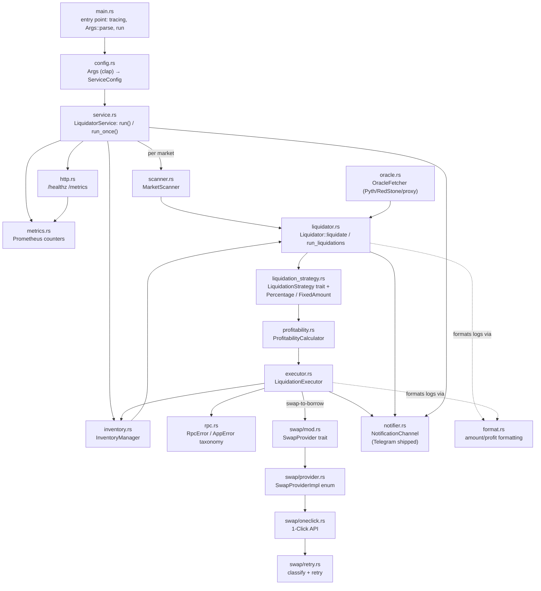

# Architecture

This document maps the module graph in [`src/`](../src/) and the data that flows between modules during one liquidation round. For the round's control flow as a numbered pipeline, see the README's [How it works](../README.md#how-it-works) section — this document is the module-level companion to it.

## Module graph

External I/O crosses two boundaries: NEAR RPC / contract calls (registry, market, token contracts) go through the in-process `templar-gateway-client` dependency that every module above ultimately calls into; Pyth Hermes is a plain HTTPS call made from `oracle.rs`, and the RedStone public price API (`api.redstone.finance`) a plain HTTPS call made from `redstone.rs`; the Lazer (Pyth Pro) price API a Bearer-token HTTPS call made from `lazer.rs` (only when `LAZER_API_TOKEN` is configured); 1-Click is an HTTPS API plus NEAR token transfers, from `swap/`.

## Module responsibilities

**`main.rs`** — binary entry point. Sets up `tracing_subscriber`, parses `Args`, builds the `ServiceConfig`, and dispatches to `service::run()` (loop mode) or `service::run_once()` (once mode), turning the latter's `Result` into a process exit code.

**`config.rs`** — CLI argument parsing (`Args`, via `clap`'s `env`-aware derive) and translation into `ServiceConfig`. Owns the mutual-exclusivity checks (partial vs. fixed-amount strategy, Telegram token/chat-id pairing) that panic at startup rather than producing a half-configured bot.

**`service.rs`** — service lifecycle. `LiquidatorService::new` wires the gateway client, inventory manager, swap providers, and oracle fetcher from `ServiceConfig`. `run()` is the long-lived loop: registry refresh and liquidation rounds tick on independent `tokio::time::interval`s. `run_once()` performs exactly one refresh and one round, then explicitly drains the notifier before returning — otherwise the tokio runtime shutting down when `main` exits could cancel an in-flight notification send. Loop mode shuts down gracefully on SIGTERM/ctrl-C: in-flight positions finish, no new ones start (a round in flight stops feeding positions to its worker pool), pending notifications drain, and the process exits 0 — the contract `docker compose stop`, Kubernetes, and systemd all assume when they send SIGTERM and wait a grace period before SIGKILL. A second signal force-exits immediately (code 130).

**`scanner.rs`** — `MarketScanner`: fetches a market's borrow positions (paginated for large markets) and evaluates liquidation status per position against a supplied oracle response. (Contract-version gating happens once, during the service's registry refresh — not here.)

**`liquidator.rs`** — the lib root and orchestrator. Its round loop screens every fetched position locally — `MarketConfiguration::borrow_status`, the same function the contract runs, over the round's oracle prices — so only apparent liquidation candidates pay for an on-chain status read; the market contract's answer inside `liquidate()` stays authoritative for every candidate. Crate-level docs describe the pipeline and the three extension seams (`SwapProvider`, `LiquidationStrategy`, `NotificationChannel`). Owns the error taxonomy (`LiquidatorError`, `ErrorPhase`, `NotificationKind`, `LiquidationOutcome`) and the `Liquidator` type, whose `liquidate()` drives one position through strategy sizing → profitability → execution → collateral handling → notification (with the loop-liquidation retry wrapped around all of it), and `run_liquidations()` drives every position in one market.

**`liquidation_strategy.rs`** — the `LiquidationStrategy` trait plus the two built-ins: `PercentageLiquidationStrategy` (percentage-of-inventory, the default, also *is* full liquidation at 100%) and `FixedAmountLiquidationStrategy` (fixed USD amount per liquidation, USD-stablecoin borrow assets only). A strategy decides *how much* to repay and — via `should_liquidate` — whether the sizing is still worth submitting; it does not decide *whether* a position is liquidatable (the scanner already established that). `max_liquidation_percentage()` is logging-only, not enforced against the sizing output — see [docs/backlog.md](backlog.md).

**`profitability.rs`** — `ProfitabilityCalculator`: converts USD gas-cost estimates and collateral amounts into borrow-asset units via oracle prices, and computes net profit / profit percentage for logging.

**`executor.rs`** — `LiquidationExecutor`: submits the `market::Liquidate` transaction against an inventory reservation **its caller has already taken** (`liquidate()` reserves ahead of its paid oracle push, so an inventory-race loser under `POSITION_CONCURRENCY` skips before spending gas). Because a NEAR `ft_transfer_call` can panic in its receiver callback while the top-level transaction reports success, it inspects the receipts before trusting the outcome — then consumes the reservation on success, releases it on failure, and applies the collateral strategy (hold, or a just-in-time swap back to the borrow asset). `consume`/`release` saturate rather than error, so the ledger only protects callers that honor the reservation contract on `execute_liquidation`.

**`inventory.rs`** — `InventoryManager`: tracks available (`balance − reserved`) balances per asset across all configured markets, behind an `Arc<RwLock<_>>` for concurrent access. Liquidations only proceed when inventory actually covers the sizing decision.

**`oracle.rs`** — `OracleFetcher`: fetches prices across every oracle type Templar markets use — Pyth (via Hermes HTTP, not the on-chain contract directly), LST oracles with price transformers, and proxy-oracle feeds, which are composed off-chain at scan time from each feed's configured sources in order, taking the first leg that yields a fresh price (Hermes for Pyth sources, the RedStone public API via `redstone.rs` for RedStone sources, the token-gated Lazer/Pyth Pro API — or, without a token, a free view read of the adapter contract — for Lazer sources, transformer inputs via free view calls), falling back to the proxy's on-chain price cache when every leg fails or reads stale. It can also push fresh prices on-chain immediately before a liquidation transaction, since the market contract reads its own on-chain oracle state at execution time — scan-side composition never replaces that.

**`redstone.rs`** — RedStone public price API client (`api.redstone.finance`), keyed by symbol, with staleness and future-skew guards. Scan-side only.

**`lazer.rs`** — Lazer (Pyth Pro) price API client (`POST /v1/latest_price`, Bearer-token authenticated — Lazer has no anonymous tier), keyed by Lazer feed id, projecting EMA with per-feed staleness and future-skew guards. Scan-side only; used only when `LAZER_API_TOKEN` is set.

**`swap/mod.rs`** — the `SwapProvider` trait: the swap-provider extension seam. Not object-safe (its methods are generic over asset class), so dynamic dispatch goes through `swap/provider.rs`'s `SwapProviderImpl` enum instead.

**`swap/oneclick.rs`** — 1-Click API provider for NEAR Intents (NEP-245) cross-chain swaps: quote → deposit → poll to a terminal status.

**`swap/retry.rs`** — swap error classification split by the one boundary that decides retry safety: `SwapErrorKind` is `PreDeposit` (idempotent phases — network/server/rate-limit errors retry, validation errors don't) or `PostDeposit` (`Indeterminate`: outcome unknown, funds may have moved; `Definitive`: funds disposition confirmed, on-chain revert or venue-confirmed refund — both carry the deposit address and neither is ever retried, structurally). Plus the generic retry wrapper swaps run through.

**`notifier.rs`** — notifications; the notification extension seam: the `NotificationChannel` trait (`send(&self, text)`; Telegram is the shipped implementation) behind a shell that owns failure dedup, the in-flight semaphore, and `drain()` — a fork's channel implements the trait and plugs into `Notifier::with_channel`.

**`metrics.rs`** — dependency-free Prometheus text-format metrics (counters, gauges, and labelled families — `inventory_reserved_raw{asset=…}` tracks live per-asset reservations), with `# HELP`/`# TYPE` lines, process-lifetime, exposed via `http.rs`.

**`http.rs`** — the optional operational HTTP surface (`GET /healthz`, `GET /metrics`), started only when `HTTP_PORT` is set and never in `RUN_MODE=once`.

**`format.rs`** — human-readable asset-amount and profit formatting shared by `liquidator.rs` and `executor.rs`'s log lines.

**`rpc.rs`** — the error taxonomy for the RPC/gateway boundary (`RpcError`, `AppError`) and NEP-330 contract-source-metadata shapes. The low-level blockchain plumbing itself (signing, submission, polling to finality) lives in the in-process `templar-gateway-client` dependency, not in this crate.

## Extension seams

A fork that needs behavior beyond what configuration exposes has three extension seams, in-tree — all traits; see the doc comments on each for the exact contract a conforming implementation must uphold:

- [`swap::SwapProvider`](../src/swap/mod.rs) — a trait: a DEX/aggregator integration, for routing through a venue other than 1-Click. Implement it for a new type and add a variant to `SwapProviderImpl` (the enum is the dynamic-dispatch point; see `swap/mod.rs` on the slippage bar any AMM provider must clear).
- [`liquidation_strategy::LiquidationStrategy`](../src/liquidation_strategy.rs) — a trait: the sizing policy, for logic beyond percentage-of-inventory or fixed-USD-amount (e.g. per-market caps, sizing off inventory pressure).
- [`notifier::NotificationChannel`](../src/notifier.rs) — a trait: one method, `send(&self, text)`, delivering a single already-formatted message. Implement it for a new channel (Slack, PagerDuty, a webhook) and construct the notifier with `Notifier::with_channel` — the surrounding shell keeps failure dedup, the in-flight cap, and `drain()` regardless of channel. Telegram (`TelegramChannel`) is the shipped implementation.
