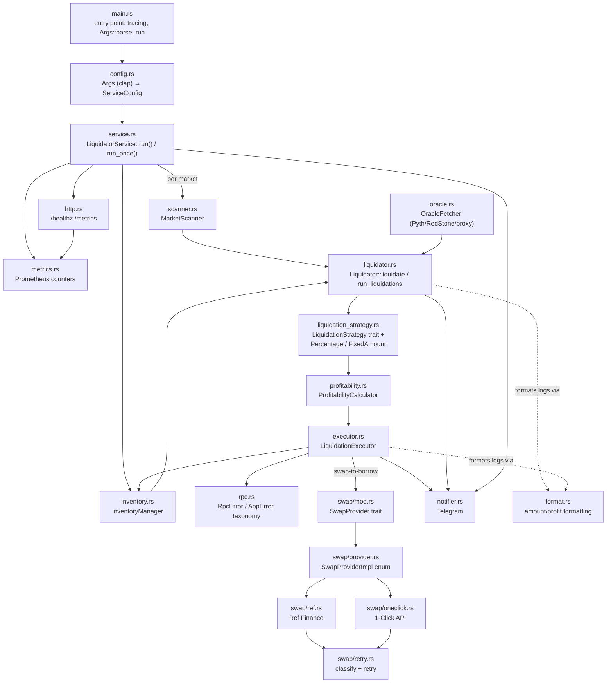

# Architecture

This document maps the module graph in [`src/`](../src/) and the data that flows between modules during one liquidation round. For the round's control flow as a numbered pipeline, see the README's [How it works](../README.md#how-it-works) section — this document is the module-level companion to it.

## Module graph

External I/O crosses two boundaries: NEAR RPC / contract calls (registry, market, token contracts) go through the in-process `templar-gateway-client` dependency that every module above ultimately calls into; Pyth Hermes and the RedStone gateway are plain HTTPS calls made from `oracle.rs`; Ref Finance and 1-Click are NEAR contract calls and an HTTPS API respectively, both from `swap/`.

## Module responsibilities

**`main.rs`** — binary entry point. Sets up `tracing_subscriber`, parses `Args`, builds the `ServiceConfig`, and dispatches to `service::run()` (loop mode) or `service::run_once()` (once mode), turning the latter's `Result` into a process exit code.

**`config.rs`** — CLI argument parsing (`Args`, via `clap`'s `env`-aware derive) and translation into `ServiceConfig`. Owns the mutual-exclusivity checks (partial vs. fixed-amount strategy, Telegram token/chat-id pairing) that panic at startup rather than producing a half-configured bot.

**`service.rs`** — service lifecycle. `LiquidatorService::new` wires the gateway client, inventory manager, swap providers, and oracle fetcher from `ServiceConfig`. `run()` is the long-lived loop: registry refresh and liquidation rounds tick on independent `tokio::time::interval`s. `run_once()` performs exactly one refresh and one round, then explicitly drains the notifier before returning — otherwise the tokio runtime shutting down when `main` exits could cancel an in-flight Telegram POST.

**`scanner.rs`** — `MarketScanner`: fetches a market's borrow positions (paginated for large markets), checks NEP-330 contract-version compatibility, and evaluates liquidation status per position against a supplied oracle response.

**`liquidator.rs`** — the lib root and orchestrator. Crate-level docs describe the pipeline and the three extension seams (`SwapProvider`, `LiquidationStrategy`, `Notifier`). Owns the error taxonomy (`LiquidatorError`, `ErrorPhase`, `NotificationKind`, `LiquidationOutcome`) and the `Liquidator` type, whose `liquidate()` drives one position through strategy sizing → profitability → execution → collateral handling → notification (with the loop-liquidation retry wrapped around all of it), and `run_liquidations()` drives every position in one market.

**`liquidation_strategy.rs`** — the `LiquidationStrategy` trait plus the two built-ins: `PercentageLiquidationStrategy` (percentage-of-inventory, the default, also *is* full liquidation at 100%) and `FixedAmountLiquidationStrategy` (fixed USD amount per liquidation, USD-stablecoin borrow assets only). A strategy decides *how much* to repay and — via `should_liquidate` — whether the sizing is still worth submitting; it does not decide *whether* a position is liquidatable (the scanner already established that). `max_liquidation_percentage()` is logging-only, not enforced against the sizing output — see [docs/backlog.md](backlog.md).

**`profitability.rs`** — `ProfitabilityCalculator`: converts USD gas-cost estimates and collateral amounts into borrow-asset units via oracle prices, and computes net profit / profit percentage for logging.

**`executor.rs`** — `LiquidationExecutor`: reserves inventory, submits the `market::Liquidate` transaction, and — because a NEAR `ft_transfer_call` can panic in its receiver callback while the top-level transaction still reports success — inspects the transaction's receipts to detect a reverted-but-"successful" liquidation before releasing the reservation. On success, applies the collateral strategy (hold, or an immediate just-in-time swap back to the borrow asset).

**`inventory.rs`** — `InventoryManager`: tracks available (`balance − reserved`) balances per asset across all configured markets, behind an `Arc<RwLock<_>>` for concurrent access. Liquidations only proceed when inventory actually covers the sizing decision.

**`oracle.rs`** — `OracleFetcher`: fetches prices across every oracle type Templar markets use — Pyth (via Hermes HTTP, not the on-chain contract directly), RedStone-backed feeds through proxy-oracle cache reads, and LST oracles with price transformers — and can push fresh prices on-chain immediately before a liquidation transaction, since the market contract reads its own on-chain oracle state at execution time.

**`swap/mod.rs`** — the `SwapProvider` trait: the swap-provider extension seam. Not object-safe (its methods are generic over asset class), so dynamic dispatch goes through `swap/provider.rs`'s `SwapProviderImpl` enum instead.

**`swap/ref.rs`** — Ref Finance AMM provider for NEP-141 tokens, with automatic wNEAR routing for pairs without a direct pool.

**`swap/oneclick.rs`** — 1-Click API provider for NEAR Intents (NEP-245) cross-chain swaps: quote → deposit → poll to a terminal status.

**`swap/retry.rs`** — shared error classification (retryable network/server/rate-limit errors vs. permanent validation errors) and the generic retry wrapper both providers run swaps through.

**`notifier.rs`** — Telegram notifications; the notification extension seam (no trait boundary yet — a fork wanting another channel extends or replaces this type directly). Also owns consecutive-scan-failure threshold tracking and per-(market, borrower, error-class) failure-notification dedup/cooldown.

**`metrics.rs`** — dependency-free Prometheus text-format counters and one gauge, process-lifetime, exposed via `http.rs`.

**`http.rs`** — the optional operational HTTP surface (`GET /healthz`, `GET /metrics`), started only when `HTTP_PORT` is set and never in `RUN_MODE=once`.

**`format.rs`** — human-readable asset-amount and profit formatting shared by `liquidator.rs` and `executor.rs`'s log lines.

**`rpc.rs`** — the error taxonomy for the RPC/gateway boundary (`RpcError`, `AppError`) and NEP-330 contract-source-metadata shapes. The low-level blockchain plumbing itself (signing, submission, polling to finality) lives in the in-process `templar-gateway-client` dependency, not in this crate.

## Extension seams

A fork that needs behavior beyond what configuration exposes implements one of three traits in-tree — see the doc comments on each for the exact contract a conforming implementation must uphold:

- [`swap::SwapProvider`](../src/swap/mod.rs) — a DEX/aggregator integration, for routing through a venue other than Ref Finance or 1-Click.
- [`liquidation_strategy::LiquidationStrategy`](../src/liquidation_strategy.rs) — the sizing policy, for logic beyond percentage-of-inventory or fixed-USD-amount (e.g. per-market caps, sizing off inventory pressure).
- [`notifier::Notifier`](../src/notifier.rs) — currently Telegram-only with no trait in front of it; extending or replacing the type directly is today's path to another channel.
